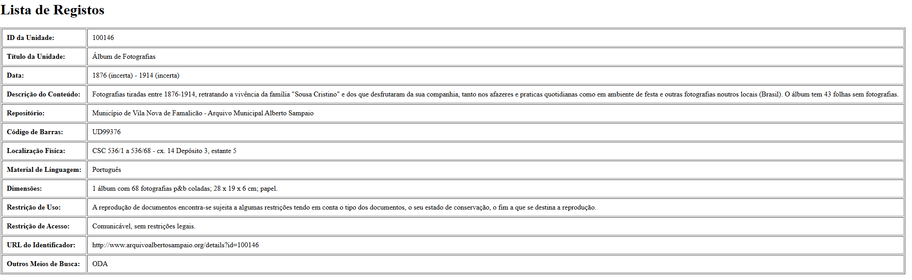
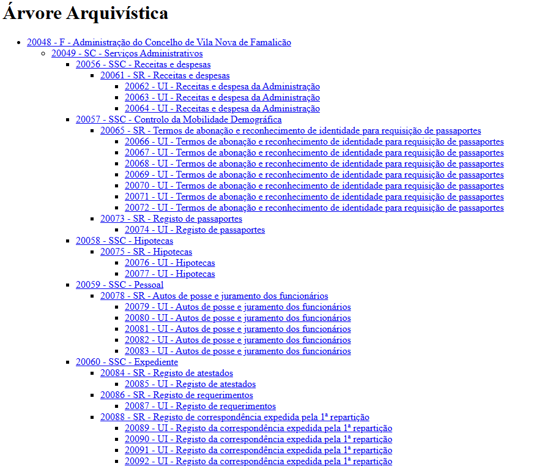
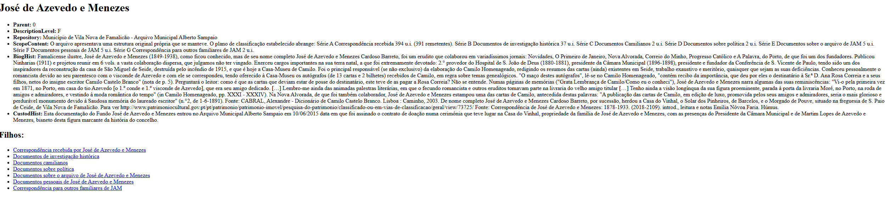
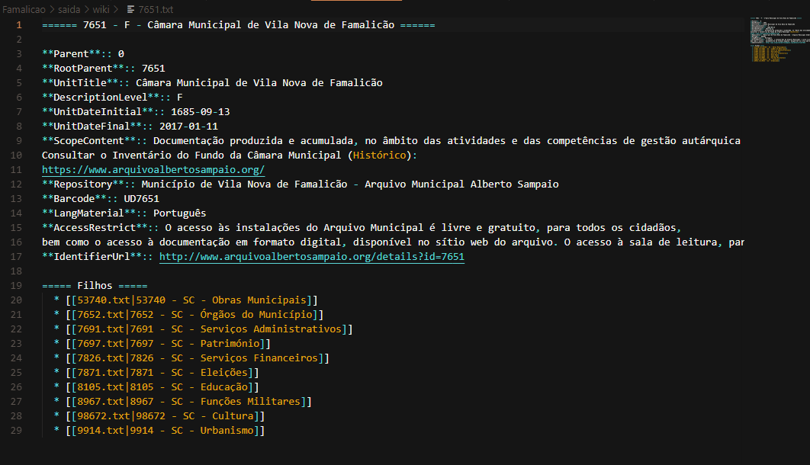
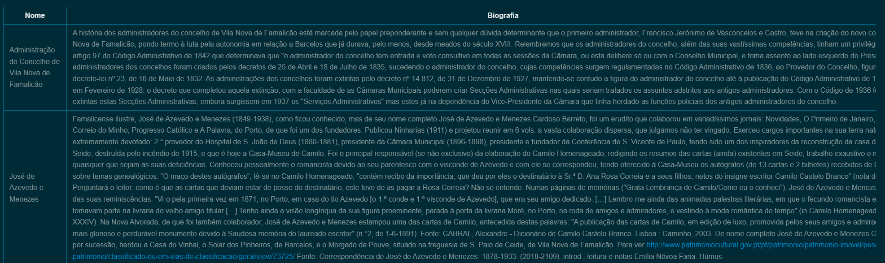

# SPLN-TP1

## Desenvolvido por:
- José Correia, PG55967
- Gonçalo Costa, PG55944
- Rodrigo Novo, PG56006

# Relatório Detalhado do Projeto de Processamento Arquivístico

## 📅 Contexto Geral
Este projeto teve como objetivo processar dados em formato XML provenientes de um repositório OAI-PMH, estruturando e apresentando metadados arquivísticos de forma legível e navegável. Os dados analisados são referentes ao Arquivo Municipal Alberto Sampaio, cuja complexidade e riqueza semântica ofereceram desafios e oportunidades de aprendizagem em processamento de dados, organização hierárquica, geração de HTML/Wiki, NLP com spaCy, entre outros.

---

## 🔍 Ponto 1 e 2: Recolha e Exploração dos Registos

### Ficheiro: `download.py`
O script inicia a recolha de registos através de requisições HTTP ao endpoint OAI-PMH. Utiliza a opção `metadataPrefix=aif` e, caso haja muitos registos, recorre ao `resumptionToken` para continuar a coleta em várias iterações.

Uma decisão que o grupo tomou foi grupar os registos em um único XML com uma tag personalizada `<OAI-PMH-Records>` para facilitar o parsing com `lxml.etree` posteriormente.

### Ficheiro: `check_fields.py`
Este script faz a análise de todos os campos existentes nos registos, usando `defaultdict(set)` para agrupar os valores por nome de campo. Imprime exemplos de cada campo e ajuda a identificar quais campos são constantes ou irrelevantes para as fases seguintes.

Isto também permitiu identificar metadados repetidos (como `CountryCode`) que podem ser ignorados na visualização final.

Geramos também um `output.html` de forma a facilitar a visualização dos dados, que contém uma tabela com os campos e exemplos de valores. Este ficheiro é gerado com `prettytable` e contém os seguintes campos

##### Exemplo



---

## 📄 Ponto 3: Construção da Árvore Arquivística

### Ficheiro: `build_arq_tree.py`
Reconstruímos a estrutura hierárquica dos registos com base nos campos `ID` e `Parent`. Dois dicionários foram usados:
- `nos`: para armazenar os dados de cada registo.
- `filhos`: para mapear cada pai aos seus filhos.

A estrutura permite construir a árvore de forma eficiente e identificar as raízes de forma clara.

Decidimos também usar `sorted()` para ordenar os filhos por ID, facilitando a legibilidade da árvore.

Reparamos que alguns registos nos records relativamente a Ponte de Lima, estavam isolados na árvore, sem pais. Reparamos que estes registos tinha o `Parent` em comumm tendo esse como `ID 1107983`, que não existia na árvore. Para resolver isso, decidimos criar um nó fictício `Arquivos à deriva` onde esses ficaram agrupados e organizados. O resultado final pode ser visto em `arq_tree.txt`.

---

## 🌐 Ponto 4 e 5: Exportação para HTML e Wiki

### Ficheiro: `generatewiki.py`

### Funções principais:
- `gerar_pagina_html()` cria uma página HTML para cada registo, apresentando os campos mais relevantes e uma secção com os filhos.
- `gerar_pagina_wiki()` exporta o mesmo conteúdo em formato Wiki (num txt) com sintaxe de listas e negrito.

O índice HTML é construído de forma recursiva, refletindo fielmente a estrutura hierárquica dos documentos.

As páginas são constituidas pelo título das páginas HTML apresenta apenas o nome (`UnitTitle`) para facilitar a leitura. Cada pagina relativa a cada documento contém os seguintes campos:
- `UnitTitle`: título do documento
- `Parent`: ID do pai
- `DescriptionLevel` : nivel da arvore
- `ScopeContent`: descrição do conteúdo
- `Repository`: repositório onde se encontra o documento
- `BiogHist`: Biografia
- `CustodHist`: Histórico de Custódia
- `Filhos`: Finalmente, uma lista com os filhos do documento e ligações ao mesmos para tornar a experiência de navegação mais fluida. 
  
Para observar o resultado do html basta abrir o ficheiro `saida/html/01_index.html` no browser. Para o wiki, o ficheiro `saida/wiki/<id_desejado.txt>` pode ser aberto com qualquer editor de texto.

#### Exemplo do HTML:




#### Exemplo do Wiki:

---

## 🔍 Ponto 6: Script de Procura

### Ficheiro: `search.py`

### Funcionamento:
- No modo HTML, percorre ficheiros `.html` com `os.listdir()` e procura a palavra no conteúdo.
- No modo XML, processa o XML com `etree`, extrai texto dos campos e verifica a ocorrência da palavra.

Existe a opção de escolha pelo utilizador pelos htmls ou por os xmls e a busca "case insensitive" tornam o script simples e eficiente.

#### Exemplo de execução:


---

## 🧠 Ponto 7: Extração de Entidades com spaCy

### Ficheiro: `ext_ent.py`

### Funcionamento:
- Aplica `nlp()` aos textos dos campos mais ricos.
- Extrai entidades do tipo `PER` (pessoas) e `LOC/GPE` (lugares).

Para conseguir associar o emprego a cada pessoa, reparamos ao analisar que as informações relativamente ao emprego/profissão estavam presentes nos documentos relativos ao cada pessoa pessoal ou seja que o nome aparece em `UnitTitle`, por exemplo, `...<ns1:UnitTitle>Registo do recenseamento militar de António</ns1:UnitTitle>...<ns1:ScopeContent> Naturalidade - Oliveira Santa Maria Morada - Ignora-se Data de nascimento - 1861-04-02 Emprego - Ignora-se Estado - Ignora-se</ns1:ScopeContent>...` ou seja inicialmente capuramos todos os nomes que tem emprego associado com recurso ao seguinte regex para capturar o emprego/profissão:

```python
re.search(r'(?:Profiss[aã]o|Emprego)\s*[-:]?\s*(.+)', texto)
```

Após isso caputaramos as restantes entidades, incluindo nomes e graças ao recurso de um conjunto `set` evitamos duplicados. E tudo é amarzenado em `entidades.txt`.

---

## 👨‍💼 Ponto 8: Biografias

### Ficheiro: `ext_bio.py`

### Funcionamento:
- Percorre todos os registos
- Se houver `UnitTitle` e `BiogHist`, junta num par (nome, biografia)
- Escreve uma tabela markdown com padding adaptado à largura do maior nome e remover quebras de linha da biografia para manter a formatação limpa em `biografias.md`.

#### Exemplo:



---

## 📆 Ponto 9: Agrupamento Temático

### Ficheiro: `terms.py`

### Funcionamento:
- Agrupa os registos pelo campo `Terms`
- Imprime cada tema com os títulos correspondentes em `tabela_temas.txt`

Embora o campo suporte vários temas, cada registo tinha apenas um. Isso simplificou o agrupamento.

---

## 📅 Considerações Finais

Este projeto representou uma experiência técnica e criativa na exploração de dados arquivísticos reais. Envolveu:
- Aquisição via OAI-PMH
- Estruturação hierárquica
- Geração de interfaces de consulta
- Análise semântica com NLP
- Criação de biografias e agrupamento temático
- Exportação para HTML e Wiki
  
  

### Destaques:
- A árvore HTML como representação visual intuitiva
- Ligação entre pessoas e profissões via heurística textual
- Regexes flexíveis que lidam bem com variantes linguísticas
- A utilização de spaCy para extração de entidades, permitindo uma análise mais profunda dos dados
- A criação de uma tabela markdown para biografias, facilitando a leitura e compreensão dos dados
- A capacidade de agrupar registos por temas, permitindo uma navegação mais intuitiva pelos dados
- A flexibilidade do script de procura, permitindo ao utilizador escolher entre HTML e XML
- A utilização de `defaultdict` para simplificar a contagem e agrupamento de dados e evitar duplicados
- A criação de um índice HTML que reflete a estrutura hierárquica dos documentos, facilitando a navegação
- A utilização de `prettytable` para gerar tabelas legíveis e organizadas, facilitando a visualização dos dados
- A utilização de `os.listdir()` para percorrer ficheiros de forma eficiente e organizada
- A utilização de `lxml.etree` para processar XML de forma eficiente e organizada
- A utilização de `sorted()` para ordenar os filhos por ID, facilitando a legibilidade da árvore


